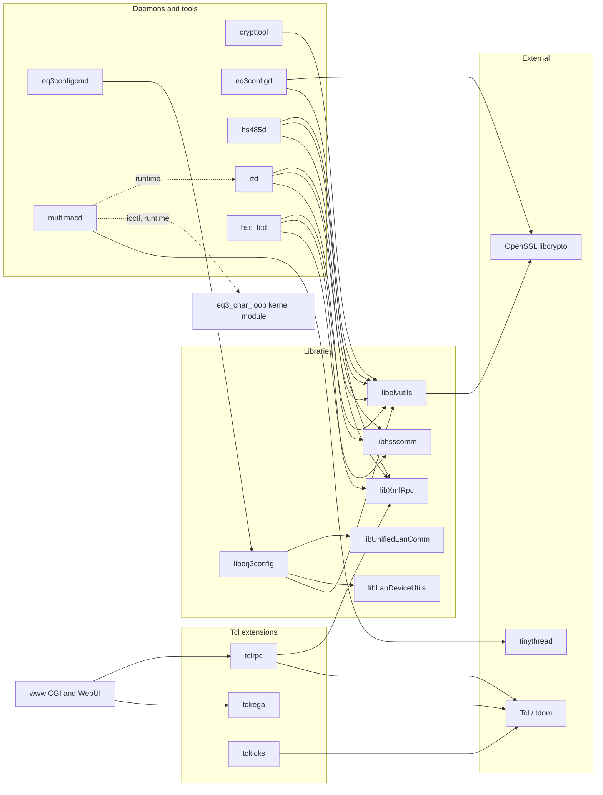

# Dependency Graph

Based on `cross-cutting/dependencies.md` (link-level and runtime coupling).

```mermaid
graph LR
    subgraph ext[External]
        openssl[OpenSSL libcrypto]
        tcl[Tcl / tdom]
        tinythread[tinythread]
    end
    subgraph libs[Libraries]
        elvutils[libelvutils]
        eq3config[libeq3config]
        landev[libLanDeviceUtils]
        unilan[libUnifiedLanComm]
        hsscomm[libhsscomm]
        xmlrpc[libXmlRpc]
    end
    subgraph daemons[Daemons and tools]
        crypttool
        eq3configd
        eq3configcmd
        hs485d
        rfd
        hssled[hss_led]
        multimacd
    end
    subgraph tclext[Tcl extensions]
        tclrega
        tclrpc
        tclticks
    end
    eq3loop[eq3_char_loop kernel module]
    www[www CGI and WebUI]

    elvutils --> openssl
    crypttool --> elvutils
    eq3configd --> elvutils
    eq3configd --> openssl
    eq3configcmd --> eq3config
    eq3config --> elvutils
    eq3config --> landev
    eq3config --> unilan
    hs485d --> hsscomm
    rfd --> hsscomm
    hssled --> hsscomm
    hs485d --> xmlrpc
    rfd --> xmlrpc
    hssled --> xmlrpc
    hs485d --> elvutils
    rfd --> elvutils
    hssled --> elvutils
    multimacd --> tinythread
    tclrega --> tcl
    tclrpc --> tcl
    tclticks --> tcl
    tclrpc --> xmlrpc
    www --> tclrega
    www --> tclrpc
    multimacd -.->|ioctl, runtime| eq3loop
    multimacd -.->|runtime| rfd
```
