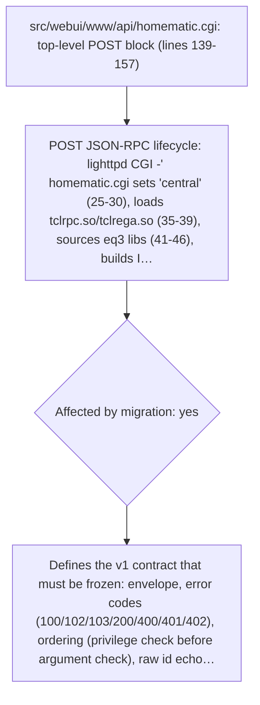

# CF001: POST JSON-RPC lifecycle: lighttpd CGI -' homematic.cgi sets 'central' (25-30), loads tclr…

```mermaid
flowchart TD
  A["src/webui/www/api/homematic.cgi: top-level POST block (lines 139-157)"] --> B["POST JSON-RPC lifecycle: lighttpd CGI -' homematic.cgi sets 'central' (25-30), loads tclrpc.so/tclrega.so (35-39), sources eq3 libs (41-46), builds I…"]
  B --> C{"Affected by migration: yes"}
  C --> D["Defines the v1 contract that must be frozen: envelope, error codes (100/102/103/200/400/401/402), ordering (privilege check before argument check), raw id echo…"]
```
