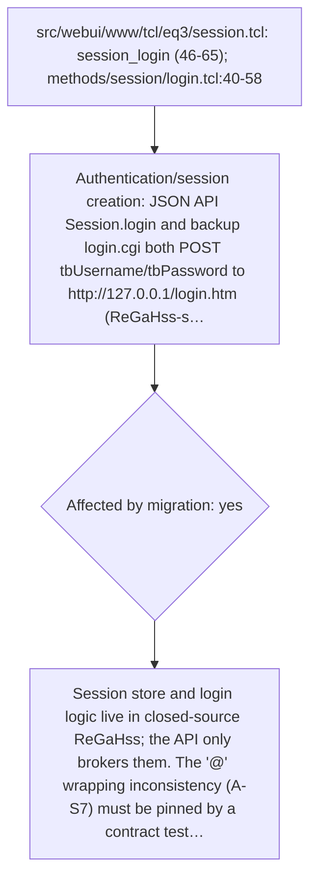

# CF002: Authentication/session creation: JSON API Session.login and backup login.cgi both POST tb…

```mermaid
flowchart TD
  A["src/webui/www/tcl/eq3/session.tcl: session_login (46-65); methods/session/login.tcl:40-58"] --> B["Authentication/session creation: JSON API Session.login and backup login.cgi both POST tbUsername/tbPassword to http://127.0.0.1/login.htm (ReGaHss-s…"]
  B --> C{"Affected by migration: yes"}
  C --> D["Session store and login logic live in closed-source ReGaHss; the API only brokers them. The '@' wrapping inconsistency (A-S7) must be pinned by a contract test…"]
```
