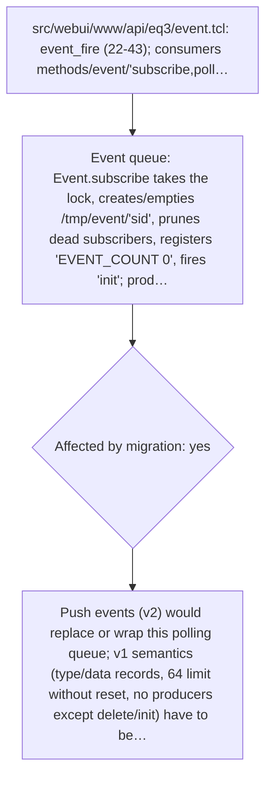

# CF003: Event queue: Event.subscribe takes the lock, creates/empties /tmp/event/'sid', prunes dea…

```mermaid
flowchart TD
  A["src/webui/www/api/eq3/event.tcl: event_fire (22-43); consumers methods/event/'subscribe,poll…"] --> B["Event queue: Event.subscribe takes the lock, creates/empties /tmp/event/'sid', prunes dead subscribers, registers 'EVENT_COUNT 0', fires 'init'; prod…"]
  B --> C{"Affected by migration: yes"}
  C --> D["Push events (v2) would replace or wrap this polling queue; v1 semantics (type/data records, 64 limit without reset, no producers except delete/init) have to be…"]
```
