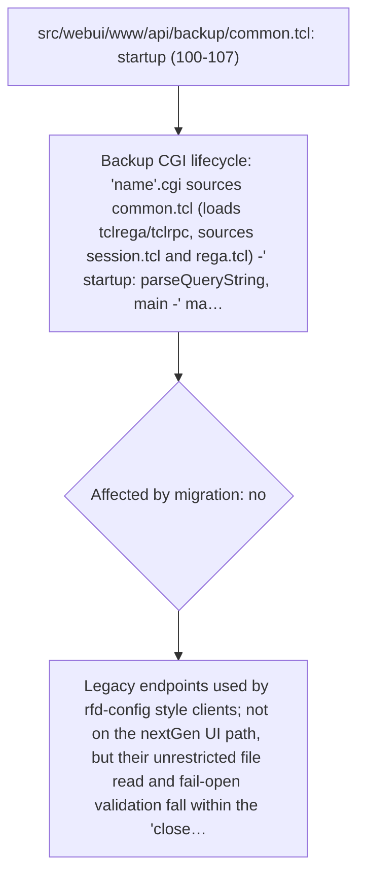

# CF004: Backup CGI lifecycle: 'name'.cgi sources common.tcl (loads tclrega/tclrpc, sources sessio…

```mermaid
flowchart TD
  A["src/webui/www/api/backup/common.tcl: startup (100-107)"] --> B["Backup CGI lifecycle: 'name'.cgi sources common.tcl (loads tclrega/tclrpc, sources session.tcl and rega.tcl) -' startup: parseQueryString, main -' ma…"]
  B --> C{"Affected by migration: no"}
  C --> D["Legacy endpoints used by rfd-config style clients; not on the nextGen UI path, but their unrestricted file read and fail-open validation fall within the 'close…"]
```
