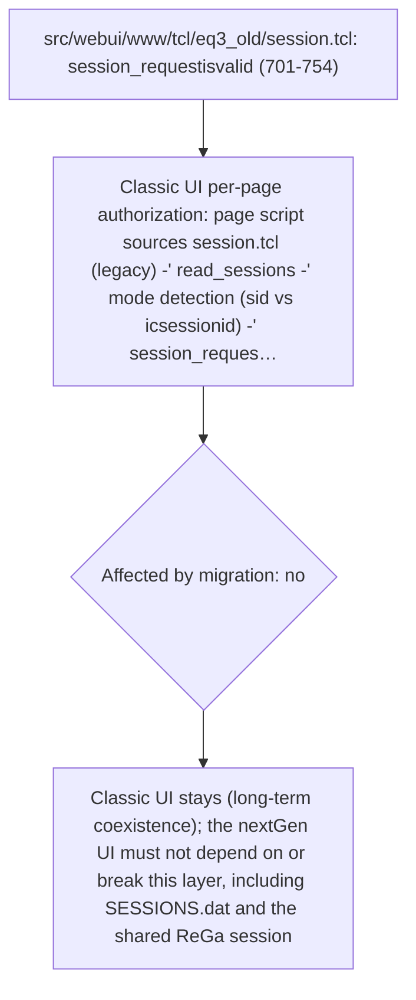

# CF005: Classic UI per-page authorization: page script sources session.tcl (legacy) -' read_sessi…

```mermaid
flowchart TD
  A["src/webui/www/tcl/eq3_old/session.tcl: session_requestisvalid (701-754)"] --> B["Classic UI per-page authorization: page script sources session.tcl (legacy) -' read_sessions -' mode detection (sid vs icsessionid) -' session_reques…"]
  B --> C{"Affected by migration: no"}
  C --> D["Classic UI stays (long-term coexistence); the nextGen UI must not depend on or break this layer, including SESSIONS.dat and the shared ReGa session"]
```
