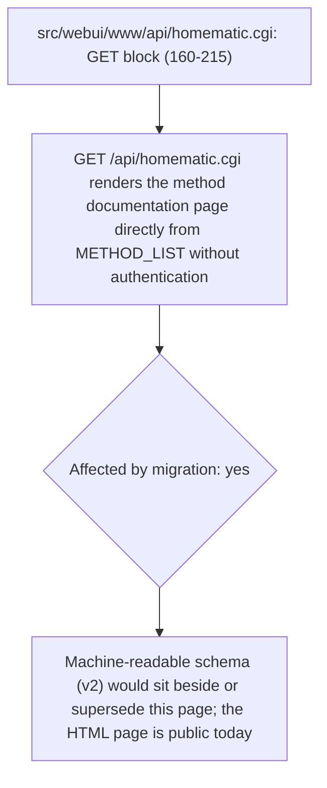

# CF006: GET /api/homematic.cgi renders the method documentation page directly from METHOD_LIST wi…

```mermaid
flowchart TD
  A["src/webui/www/api/homematic.cgi: GET block (160-215)"] --> B["GET /api/homematic.cgi renders the method documentation page directly from METHOD_LIST without authentication"]
  B --> C{"Affected by migration: yes"}
  C --> D["Machine-readable schema (v2) would sit beside or supersede this page; the HTML page is public today"]
```
