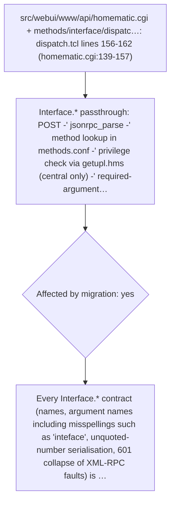

# CF007: Interface.* passthrough: POST -' jsonrpc_parse -' method lookup in methods.conf -' privil…

```mermaid
flowchart TD
  A["src/webui/www/api/homematic.cgi + methods/interface/dispatc…: dispatch.tcl lines 156-162 (homematic.cgi:139-157)"] --> B["Interface.* passthrough: POST -' jsonrpc_parse -' method lookup in methods.conf -' privilege check via getupl.hms (central only) -' required-argument…"]
  B --> C{"Affected by migration: yes"}
  C --> D["Every Interface.* contract (names, argument names including misspellings such as 'inteface', unquoted-number serialisation, 601 collapse of XML-RPC faults) is …"]
```
