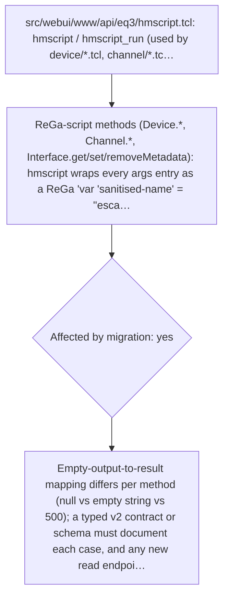

# CF008: ReGa-script methods (Device.*, Channel.*, Interface.get/set/removeMetadata): hmscript wra…

```mermaid
flowchart TD
  A["src/webui/www/api/eq3/hmscript.tcl: hmscript / hmscript_run (used by device/*.tcl, channel/*.tc…"] --> B["ReGa-script methods (Device.*, Channel.*, Interface.get/set/removeMetadata): hmscript wraps every args entry as a ReGa 'var 'sanitised-name' = ''esca…"]
  B --> C{"Affected by migration: yes"}
  C --> D["Empty-output-to-result mapping differs per method (null vs empty string vs 500); a typed v2 contract or schema must document each case, and any new read endpoi…"]
```
