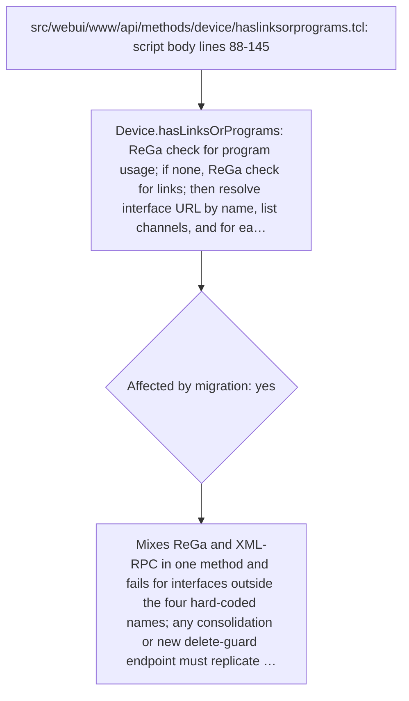

# CF009: Device.hasLinksOrPrograms: ReGa check for program usage; if none, ReGa check for links; t…

```mermaid
flowchart TD
  A["src/webui/www/api/methods/device/haslinksorprograms.tcl: script body lines 88-145"] --> B["Device.hasLinksOrPrograms: ReGa check for program usage; if none, ReGa check for links; then resolve interface URL by name, list channels, and for ea…"]
  B --> C{"Affected by migration: yes"}
  C --> D["Mixes ReGa and XML-RPC in one method and fails for interfaces outside the four hard-coded names; any consolidation or new delete-guard endpoint must replicate …"]
```
