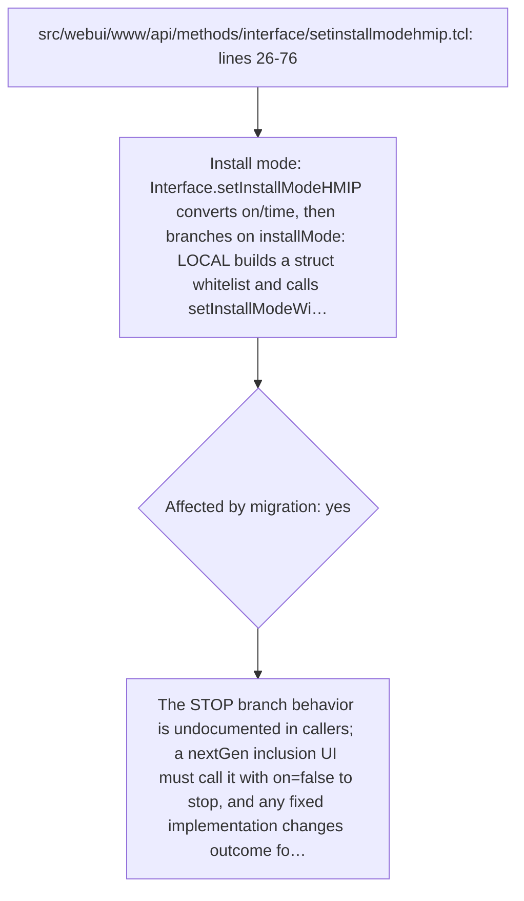

# CF010: Install mode: Interface.setInstallModeHMIP converts on/time, then branches on installMode…

```mermaid
flowchart TD
  A["src/webui/www/api/methods/interface/setinstallmodehmip.tcl: lines 26-76"] --> B["Install mode: Interface.setInstallModeHMIP converts on/time, then branches on installMode: LOCAL builds a struct whitelist and calls setInstallModeWi…"]
  B --> C{"Affected by migration: yes"}
  C --> D["The STOP branch behavior is undocumented in callers; a nextGen inclusion UI must call it with on=false to stop, and any fixed implementation changes outcome fo…"]
```
