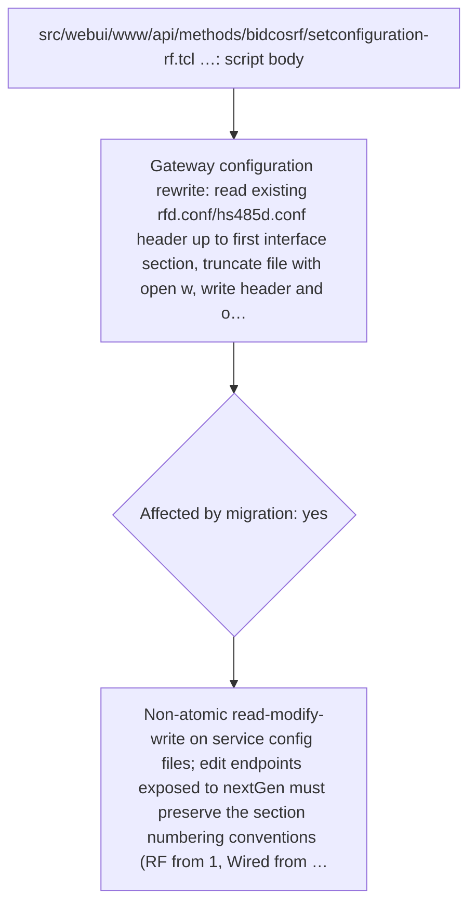

# CF011: Gateway configuration rewrite: read existing rfd.conf/hs485d.conf header up to first inte…

```mermaid
flowchart TD
  A["src/webui/www/api/methods/bidcosrf/setconfiguration-rf.tcl …: script body"] --> B["Gateway configuration rewrite: read existing rfd.conf/hs485d.conf header up to first interface section, truncate file with open w, write header and o…"]
  B --> C{"Affected by migration: yes"}
  C --> D["Non-atomic read-modify-write on service config files; edit endpoints exposed to nextGen must preserve the section numbering conventions (RF from 1, Wired from …"]
```
