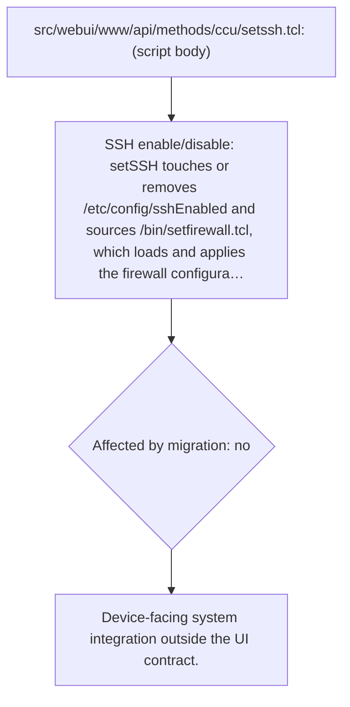

# CF012: SSH enable/disable: setSSH touches or removes /etc/config/sshEnabled and sources /bin/set…

```mermaid
flowchart TD
  A["src/webui/www/api/methods/ccu/setssh.tcl: (script body)"] --> B["SSH enable/disable: setSSH touches or removes /etc/config/sshEnabled and sources /bin/setfirewall.tcl, which loads and applies the firewall configura…"]
  B --> C{"Affected by migration: no"}
  C --> D["Device-facing system integration outside the UI contract."]
```
