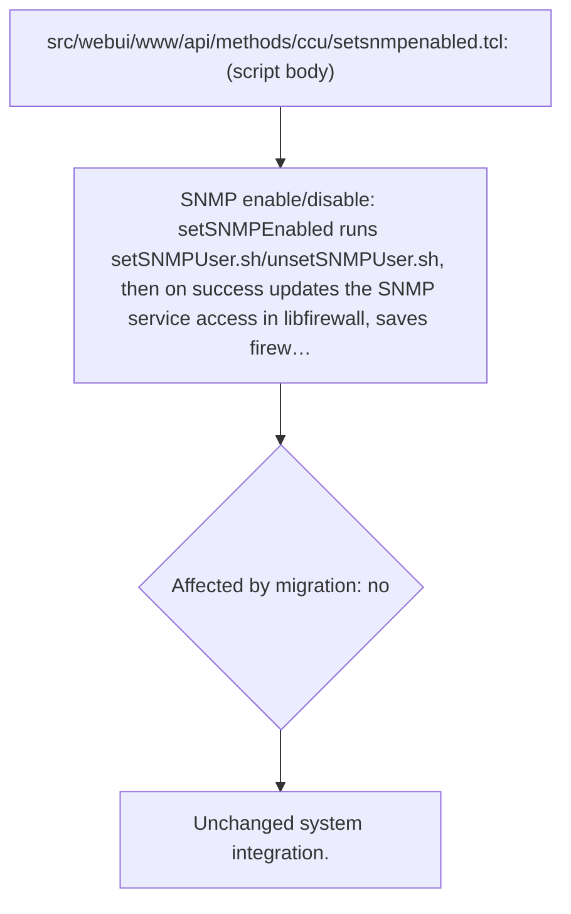

# CF013: SNMP enable/disable: setSNMPEnabled runs setSNMPUser.sh/unsetSNMPUser.sh, then on success…

```mermaid
flowchart TD
  A["src/webui/www/api/methods/ccu/setsnmpenabled.tcl: (script body)"] --> B["SNMP enable/disable: setSNMPEnabled runs setSNMPUser.sh/unsetSNMPUser.sh, then on success updates the SNMP service access in libfirewall, saves firew…"]
  B --> C{"Affected by migration: no"}
  C --> D["Unchanged system integration."]
```
