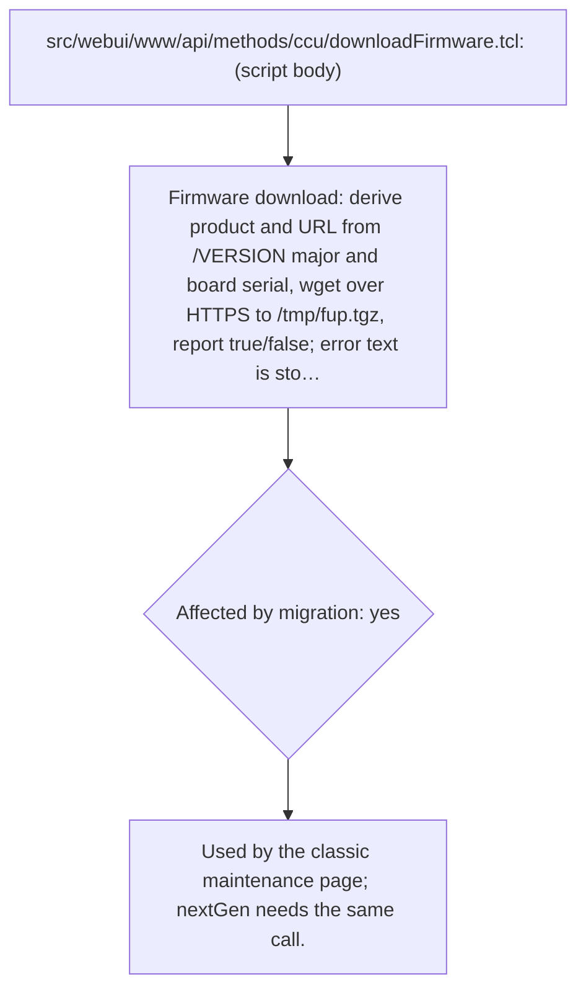

# CF014: Firmware download: derive product and URL from /VERSION major and board serial, wget over…

```mermaid
flowchart TD
  A["src/webui/www/api/methods/ccu/downloadFirmware.tcl: (script body)"] --> B["Firmware download: derive product and URL from /VERSION major and board serial, wget over HTTPS to /tmp/fup.tgz, report true/false; error text is sto…"]
  B --> C{"Affected by migration: yes"}
  C --> D["Used by the classic maintenance page; nextGen needs the same call."]
```
