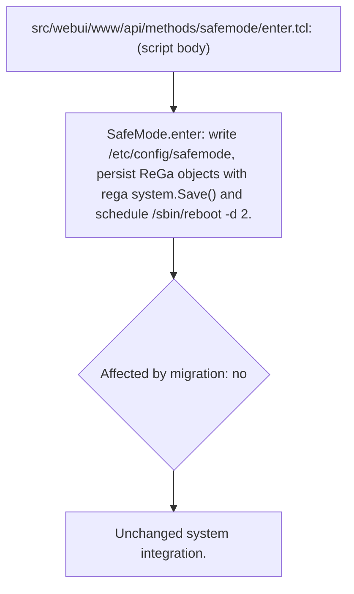

# CF015: SafeMode.enter: write /etc/config/safemode, persist ReGa objects with rega system.Save() …

```mermaid
flowchart TD
  A["src/webui/www/api/methods/safemode/enter.tcl: (script body)"] --> B["SafeMode.enter: write /etc/config/safemode, persist ReGa objects with rega system.Save() and schedule /sbin/reboot -d 2."]
  B --> C{"Affected by migration: no"}
  C --> D["Unchanged system integration."]
```
