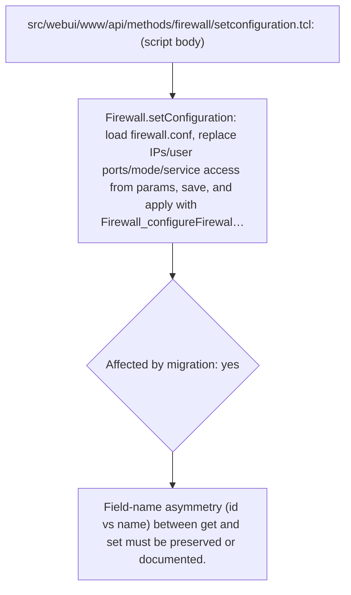

# CF016: Firewall.setConfiguration: load firewall.conf, replace IPs/user ports/mode/service access…

```mermaid
flowchart TD
  A["src/webui/www/api/methods/firewall/setconfiguration.tcl: (script body)"] --> B["Firewall.setConfiguration: load firewall.conf, replace IPs/user ports/mode/service access from params, save, and apply with Firewall_configureFirewal…"]
  B --> C{"Affected by migration: yes"}
  C --> D["Field-name asymmetry (id vs name) between get and set must be preserved or documented."]
```
