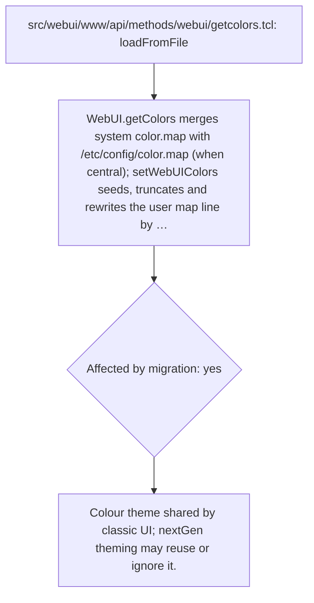

# CF017: WebUI.getColors merges system color.map with /etc/config/color.map (when central); setWeb…

```mermaid
flowchart TD
  A["src/webui/www/api/methods/webui/getcolors.tcl: loadFromFile"] --> B["WebUI.getColors merges system color.map with /etc/config/color.map (when central); setWebUIColors seeds, truncates and rewrites the user map line by …"]
  B --> C{"Affected by migration: yes"}
  C --> D["Colour theme shared by classic UI; nextGen theming may reuse or ignore it."]
```
