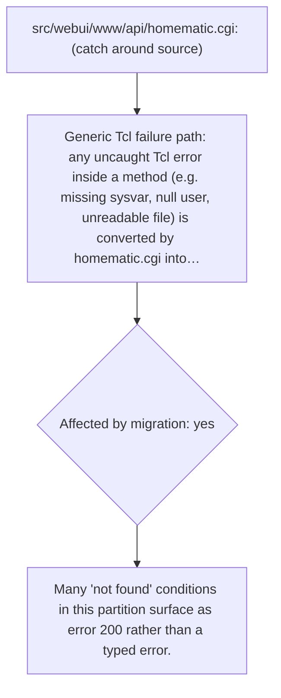

# CF018: Generic Tcl failure path: any uncaught Tcl error inside a method (e.g. missing sysvar, nu…

```mermaid
flowchart TD
  A["src/webui/www/api/homematic.cgi: (catch around source)"] --> B["Generic Tcl failure path: any uncaught Tcl error inside a method (e.g. missing sysvar, null user, unreadable file) is converted by homematic.cgi into…"]
  B --> C{"Affected by migration: yes"}
  C --> D["Many 'not found' conditions in this partition surface as error 200 rather than a typed error."]
```
