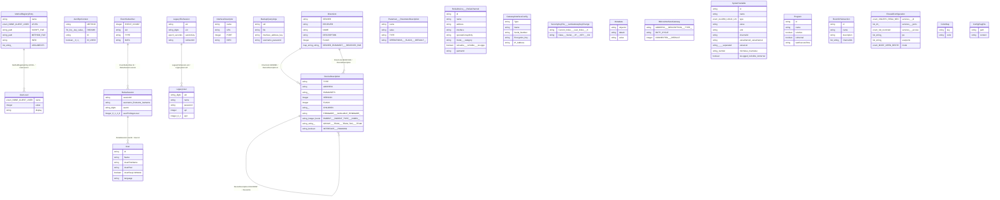

# Entity relationships

```mermaid
erDiagram
  MethodRegistryEntry {
    string name
    enum_NONE_GUEST_USER LEVEL
    string_path SCRIPT_FILE
    string_path METHOD_FILE
    string INFO
    list_string_ ARGUMENTS
  }
  JsonRpcContext {
    string METHOD
    Tcl_list__key_value_ PARAMS
    string ID
    boolean__0_1_ ID_USED
  }
  UserLevel {
    enum_NONE_GUEST_USER name
    integer value
    string display
  }
  ReGaSession {
    string sessionId
    string username_firstname_lastname
    string_digits userId
    integer_0_1_2_8 userPrivilegeLevel
  }
  LegacyFileSession {
    string sid
    string_digits uid
    epoch_seconds lastActivity
    string redirectUrl
  }
  LegacyUser {
    string_digits uid
    string name
    string password
    integer upl
    integer_0_1 eq3
  }
  EventSubscriber {
    integer EVENT_COUNT
    string sid
    string TYPE
    string DATA
  }
  InterfaceDescriptor {
    string name
    string URL
    integer PORT
    string INFO
  }
  BackupQueryArgs {
    string sid
    string file
    string interface_address_key
    string username_password
  }
  DeviceDescription {
    string TYPE
    string ADDRESS
    string__ PARAMSETS
    integer VERSION
    integer FLAGS
    string__ CHILDREN
    string FIRMWARE___AVAILABLE_FIRMWARE_
    string_integer_boole PARENT___PARENT_TYPE___INDEX__
    string_string__ GROUP___TEAM___TEAM_TAG___TEAM
    string_boolean INTERFACE___ROAMING
  }
  DirectLink {
    string SENDER
    string RECEIVER
    string NAME
    string DESCRIPTION
    integer FLAGS
    map_string_string_ SENDER_PARAMSET___RECEIVER_PAR
  }
  Paramset___ParameterDescription {
    string name
    string value
    string TYPE
    string OPERATIONS___FLAGS___DEFAULT__
  }
  ReGaDevice___ReGaChannel {
    string id
    string name
    string address
    string interface
    string operateGroupOnly
    string mode___category
    boolean isUsable___isVisible___isLogge
    string partnerId
  }
  GatewayInterfaceConfig {
    string Type
    string Name
    string Serial_Number
    string Encryption_Key
    string IP_Address
  }
  SecurityKeyFile___LanGatewayKeyChange {
    string Current_Index___Last_Index___K
    string Class___Serial___IP___KEY___CU
  }
  Metadata {
    string objectId
    string dataId
    string value
  }
  BidcosInterfaceGateway {
    string ADDRESS___DESCRIPTION___TYPE__
    string DUTY_CYCLE
    integer CONNECTED___DEFAULT
  }
  User {
    string id
    string Name
    string UserFirstName
    string UserPwd
    boolean UserEasyLinkMode
    string language
  }
  SystemVariable {
    string id
    string name
    enum_ALARM_LOGIC_LIS type
    string value
    string unit
    string channelId
    string valueName0_valueName1
    string_____separated valueList
    string_number minValue_maxValue
    boolean isLogged_isVisible_isInternal
  }
  Program {
    string id
    string name
    boolean isActive
    boolean isInternal
    string lastExecuteTime
  }
  RoomOrSubsection {
    string id
    string name
    string description
    list_string_ channelIds
  }
  FirewallConfiguration {
    enum_XMLRPC_REGA_NEO services___id
    list_int_ services___ports
    enum_full_restricted services___access
    list_string_ ips
    list_string_ userports
    enum_MOST_OPEN_RESTR mode
  }
  ColorMap {
    string key
    string color
  }
  ConfigFlagFile {
    string path
    string content
  }
  MethodRegistryEntry ||--o{ UserLevel : "MethodRegistryEntry.LEVEL -' UserLevel.n"
  ReGaSession ||--o{ User : "ReGaSession.userId -' User.id"
  LegacyFileSession ||--o{ LegacyUser : "LegacyFileSession.uid -' LegacyUser.uid"
  EventSubscriber ||--o{ ReGaSession : "EventSubscriber.id -' ReGaSession.sessio"
  DeviceDescription ||--o{ DeviceDescription : "DeviceDescription.PARENT -' DeviceDescri"
  DeviceDescription ||--o{ DeviceDescription : "DeviceDescription.CHILDREN'' -' DeviceDe"
  DirectLink ||--o{ DeviceDescription : "DirectLink.SENDER -' DeviceDescription.A"
  DirectLink ||--o{ DeviceDescription : "DirectLink.RECEIVER -' DeviceDescription"
```
