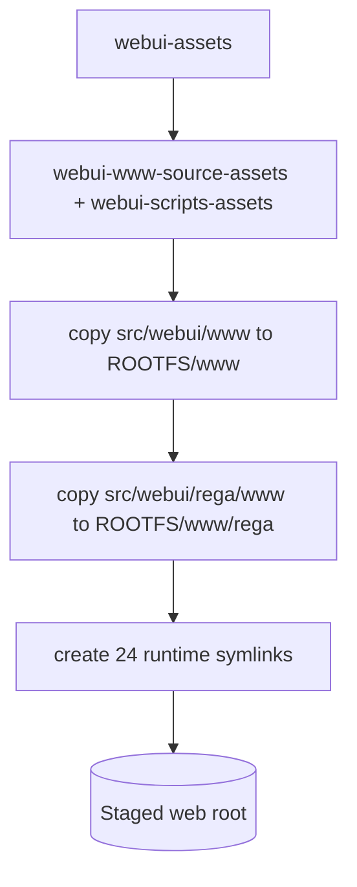

# CF001 webui-assets staging

```mermaid
flowchart TD
  A[webui-assets] --> B[webui-www-source-assets + webui-scripts-assets]
  B --> C[copy src/webui/www to ROOTFS/www]
  C --> D[copy src/webui/rega/www to ROOTFS/www/rega]
  D --> E[create 24 runtime symlinks]
  E --> F[(Staged web root)]
```
