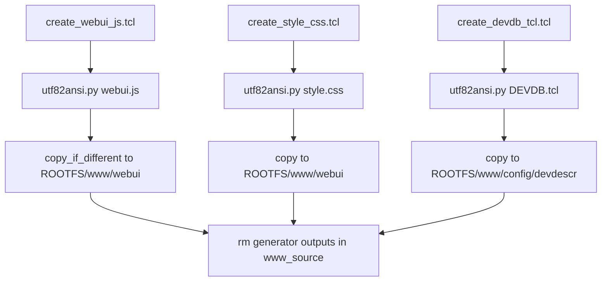

# CF002 generated assets

```mermaid
flowchart TD
  A[create_webui_js.tcl] --> B[utf82ansi.py webui.js]
  B --> C[copy_if_different to ROOTFS/www/webui]
  D[create_style_css.tcl] --> E[utf82ansi.py style.css] --> F[copy to ROOTFS/www/webui]
  G[create_devdb_tcl.tcl] --> H[utf82ansi.py DEVDB.tcl] --> I[copy to ROOTFS/www/config/devdescr]
  C --> J[rm generator outputs in www_source]
  F --> J
  I --> J
```
