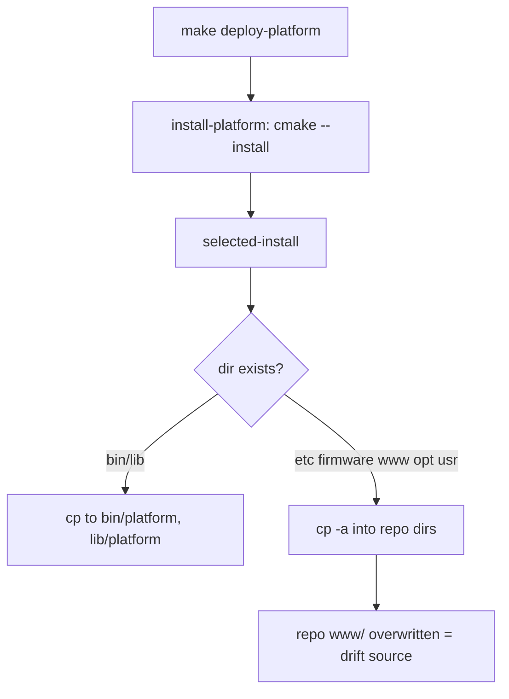

# CF003 make deploy

```mermaid
flowchart TD
  A[make deploy-platform] --> B[install-platform: cmake --install]
  B --> C[selected-install]
  C --> D{dir exists?}
  D -- bin/lib --> E[cp to bin/platform, lib/platform]
  D -- etc firmware www opt usr --> F[cp -a into repo dirs]
  F --> G[repo www/ overwritten = drift source]
```
