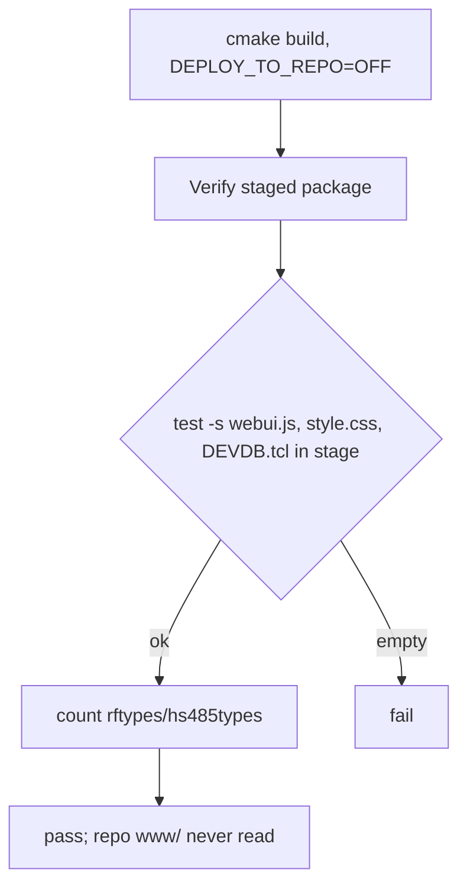

# CF004 CI staged verification

```mermaid
flowchart TD
  A[cmake build, DEPLOY_TO_REPO=OFF] --> B[Verify staged package]
  B --> C{test -s webui.js, style.css, DEVDB.tcl in stage}
  C -- ok --> D[count rftypes/hs485types]
  C -- empty --> E[fail]
  D --> F[pass; repo www/ never read]
```
