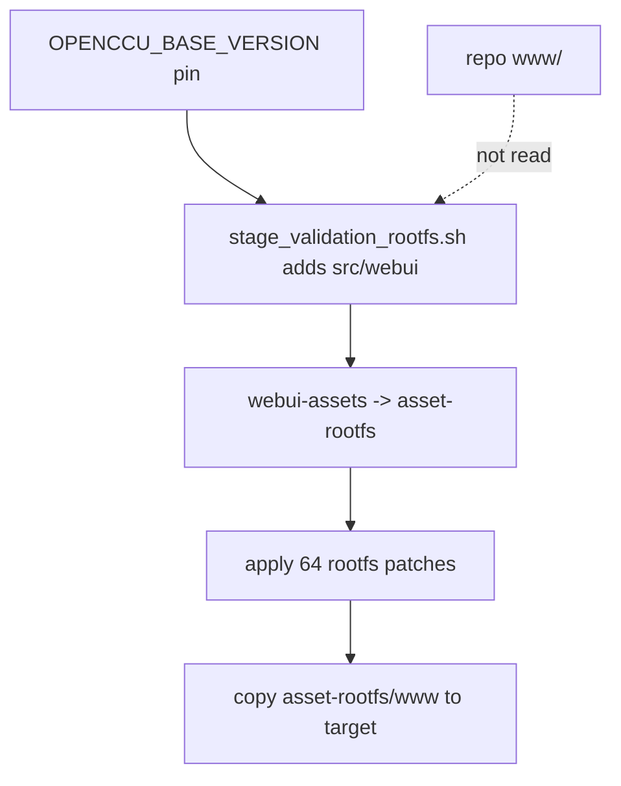

# CF006 OpenCCU sibling build

```mermaid
flowchart TD
  A[OPENCCU_BASE_VERSION pin] --> B[stage_validation_rootfs.sh adds src/webui]
  B --> C[webui-assets -> asset-rootfs]
  C --> D[apply 64 rootfs patches]
  D --> E[copy asset-rootfs/www to target]
  F[repo www/] -.not read.-> B
```
