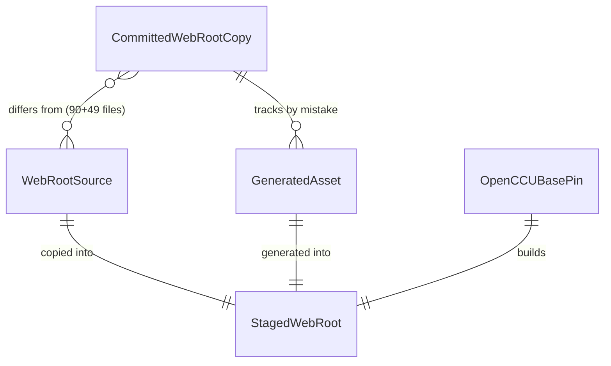

# Entity relationships

```mermaid
erDiagram
  CommittedWebRootCopy }o--o{ WebRootSource : "differs from (90+49 files)"
  CommittedWebRootCopy ||--o{ GeneratedAsset : "tracks by mistake"
  WebRootSource ||--|| StagedWebRoot : "copied into"
  GeneratedAsset ||--|| StagedWebRoot : "generated into"
  OpenCCUBasePin ||--|| StagedWebRoot : "builds"
```
